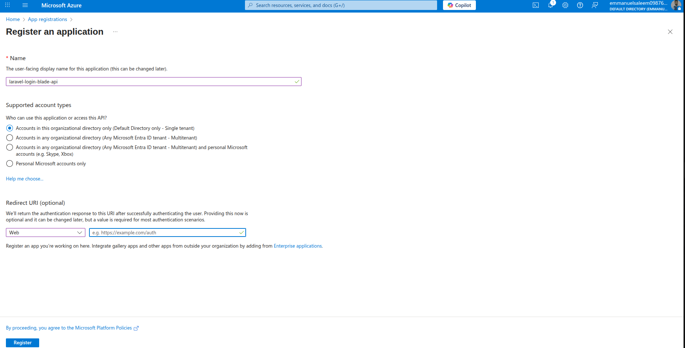
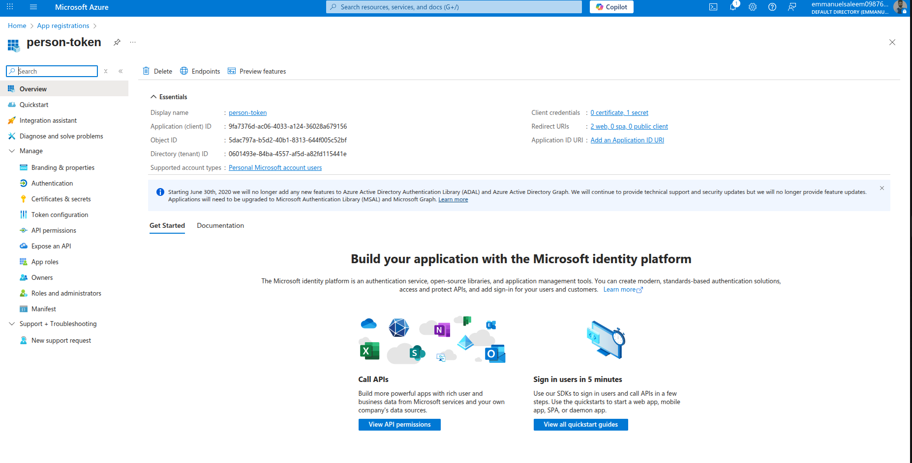
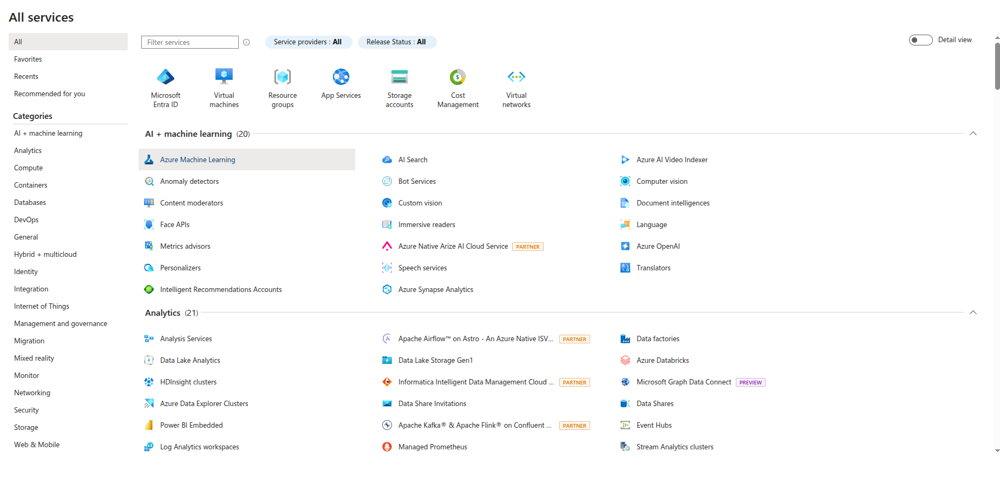
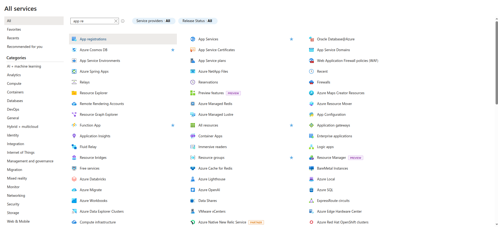
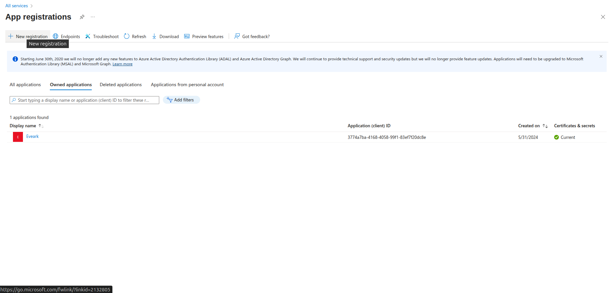

# Emmanuel Saleem Social Auth Package

A comprehensive Laravel package for OAuth social authentication with Google and Microsoft, supporting both traditional web applications and modern SPA/API-based frontends.

[](https://opensource.org/licenses/MIT)
[](https://laravel.com)
[](https://php.net)
[](https://packagist.org/packages/emmanuel-saleem/social-auth)

## 📚 Table of Contents

- [Features](#-features)
- [Requirements](#-requirements)
- [Installation](#-installation)
- [Quick Start - Add Login to Your App](#-quick-start---add-login-to-your-app) ⭐
- [Configuration](#️-configuration)
- [Usage (Web & API)](#-usage)
- [Customization](#-customization)
- [Troubleshooting](#-troubleshooting)
- [Documentation](#-documentation)

---

## ✨ Features

- 🔐 **Google OAuth** authentication (Web & API)
- 🔐 **Microsoft OAuth** authentication (Web & API)
- 🌐 **Dual Mode Support**: Traditional web and SPA/API applications
- 🎨 **Pre-built Login UI** with beautiful, modern design
- 📱 **Mobile-friendly** responsive design
- 🔄 **Auto-migration** for adding social auth fields to users table
- 🛡️ **Flexible Authentication**: Support for both **Laravel Sanctum** and **Laravel Passport**
- 🔑 **Token Management**: Automatic token generation with expiration support
- 📦 **Easy Installation** with Laravel auto-discovery
- ⚙️ **Highly Configurable**: routes, middleware, redirects, button labels, and more
- 🚀 **Production Ready** with comprehensive error handling
- 📊 **Standardized API Responses** with consistent JSON format

---

## 📋 Requirements

- PHP 8.0 or higher
- Laravel 8.x, 9.x, 10.x or 11.x
- Laravel Socialite 4.x (for Laravel 8) or 5.x (for Laravel 9+)
- Laravel Sanctum (for API authentication - default) **OR** Laravel Passport (optional)

---

## 📦 Installation

### Step 1: Install via Composer

**For Development (Current Available Version):**
```bash
composer require emmanuel-saleem/social-auth:dev-master --no-cache
```

**Alternative Installation Methods:**
```bash
# Install from GitHub directly
composer require emmanuel-saleem/social-auth:dev-master --prefer-source

# Add GitHub repository to composer.json (if needed)
# Add this to your composer.json repositories section:
# {
#     "type": "vcs", 
#     "url": "https://github.com/your-username/emmanuel-saleem-social-auth"
# }
```

> 📝 **Note:** The package is currently in development. Stable versions will be available after publishing to Packagist. Use `dev-master` for now.

### Step 2: Install Authentication System (for API routes)

**Option A: Laravel Sanctum (Recommended - Default)**

```bash
composer require laravel/sanctum
php artisan vendor:publish --provider="Laravel\Sanctum\SanctumServiceProvider"
php artisan migrate
```

**Option B: Laravel Passport (For OAuth2 Server)**

```bash
composer require laravel/passport
php artisan migrate
php artisan passport:install
```

> 📖 **See [PASSPORT_SETUP.md](./PASSPORT_SETUP.md) for detailed Passport configuration**

### Step 3: Add HasApiTokens to User Model

**For Sanctum (Default):**
```php
<?php

namespace App\Models;

use Illuminate\Foundation\Auth\User as Authenticatable;
use Laravel\Sanctum\HasApiTokens;

class User extends Authenticatable
{
    use HasApiTokens, HasFactory, Notifiable;
    
    protected $fillable = [
        'name',
        'email',
        'password',
        'google_id',
        'microsoft_id',
        'avatar',
        'google_token',
        'google_refresh_token',
        'microsoft_token',
        'microsoft_refresh_token',
        'email_verified_at',
    ];
}
```

**For Passport:**
```php
<?php

namespace App\Models;

use Illuminate\Foundation\Auth\User as Authenticatable;
use Laravel\Passport\HasApiTokens; // Use Passport instead

class User extends Authenticatable
{
    use HasApiTokens, HasFactory, Notifiable;
    
    protected $fillable = [
        'name',
        'email',
        'password',
        'google_id',
        'microsoft_id',
        'avatar',
        'google_token',
        'google_refresh_token',
        'microsoft_token',
        'microsoft_refresh_token',
        'email_verified_at',
    ];
}
```

Then configure the driver in `.env`:
```env
# For Passport (optional - default is Sanctum)
SOCIAL_AUTH_API_DRIVER=passport
```

### Step 4: Publish Package Assets

```bash
# Publish configuration file
php artisan vendor:publish --tag=emmanuel-saleem-social-auth-config

# Publish migrations
php artisan vendor:publish --tag=emmanuel-saleem-social-auth-migrations

# Publish views (optional - if you want to customize)
php artisan vendor:publish --tag=emmanuel-saleem-social-auth-views

# Run migrations
php artisan migrate
```

---

## ⚙️ Configuration

### Environment Variables

Add these to your `.env` file:

```env
# Google OAuth
GOOGLE_CLIENT_ID=your-google-client-id
GOOGLE_CLIENT_SECRET=your-google-client-secret
GOOGLE_REDIRECT_URI=http://localhost:8000/emmanuel-saleem/social-auth/google/callback

# Microsoft OAuth
MICROSOFT_CLIENT_ID=your-microsoft-client-id
MICROSOFT_CLIENT_SECRET=your-microsoft-client-secret
MICROSOFT_REDIRECT_URI=http://localhost:8000/emmanuel-saleem/social-auth/microsoft/callback

# Frontend URL (for API OAuth)
FRONTEND_URL=http://localhost:3000
```

### Update `config/services.php`

Add OAuth provider configurations:

```php
return [
    // ... other services

    'google' => [
        'client_id' => env('GOOGLE_CLIENT_ID'),
        'client_secret' => env('GOOGLE_CLIENT_SECRET'),
        'redirect' => env('GOOGLE_REDIRECT_URI'),
    ],

    'microsoft' => [
        'client_id' => env('MICROSOFT_CLIENT_ID'),
        'client_secret' => env('MICROSOFT_CLIENT_SECRET'),
        'redirect' => env('MICROSOFT_REDIRECT_URI'),
    ],
];
```

### OAuth Provider Setup

#### Google Cloud Console

Follow these steps to create OAuth credentials:

**Step 1:** Go to [Google Cloud Console](https://console.cloud.google.com/)

**Step 2:** Create a new project or select an existing one


**Step 3:** Navigate to "APIs & Services" → "Credentials"


**Step 4:** Click "CREATE CREDENTIALS" → Select "OAuth client ID"


**Step 5:** Configure the OAuth consent screen (if first time)


**Step 6:** Select "Web application" as the application type


**Step 7:** Add your application name and authorized redirect URIs:


**Authorized redirect URIs:**
- For Web: `http://localhost:8000/emmanuel-saleem/social-auth/google/callback`
- For API/SPA: `http://localhost:3000/auth/google/callback`
- For Production: `https://yourdomain.com/emmanuel-saleem/social-auth/google/callback`

**Step 8:** Click "CREATE" and you'll receive your credentials


**Step 9:** Copy the **Client ID** and **Client Secret** to your `.env` file


**Step 10:** Enable required APIs (Google+ API or People API)


✅ **Configuration Complete!** Now add the credentials to your `.env` file:

```env
GOOGLE_CLIENT_ID=your-client-id-from-step-9
GOOGLE_CLIENT_SECRET=your-client-secret-from-step-9
GOOGLE_REDIRECT_URI=http://localhost:8000/emmanuel-saleem/social-auth/google/callback
```

#### Microsoft Azure Portal

Follow these detailed steps to set up Microsoft OAuth authentication:

**Step 1: Access Azure Portal**
1. Go to [Azure Portal](https://portal.azure.com/)
2. Sign in with your Microsoft account



**Step 2: Navigate to App Registrations**
1. In the Azure portal, search for "App registrations" in the search bar
2. Click on "App registrations" from the search results



**Step 3: Create New App Registration**
1. Click "New registration" button
2. Fill in the application details:
   - **Name**: Enter your application name (e.g., "Laravel Social Auth")
   - **Supported account types**: Choose based on your needs:
     - "Personal Microsoft accounts only" - for consumer apps
     - "Accounts in any organizational directory and personal Microsoft accounts" - for broader access
   - **Redirect URI**: Add your callback URL:
     - Web: `http://localhost:8000/emmanuel-saleem/social-auth/microsoft/callback`
     - API: `http://localhost:3000/auth/microsoft/callback`



**Step 4: Configure Authentication**
1. After creating the app, go to "Authentication" in the left menu
2. Add your redirect URIs:
   - `http://localhost:8000/emmanuel-saleem/social-auth/microsoft/callback`
   - `https://yourdomain.com/emmanuel-saleem/social-auth/microsoft/callback` (for production)



**Step 5: Create Client Secret**
1. Go to "Certificates & secrets" in the left menu
2. Click "New client secret"
3. Add a description and choose expiration period
4. **Important**: Copy the secret value immediately (it won't be shown again)

**Step 6: Configure API Permissions**
1. Go to "API permissions" in the left menu
2. Click "Add a permission"
3. Select "Microsoft Graph"
4. Choose "Delegated permissions"
5. Add these permissions:
   - `openid`
   - `profile`
   - `email`
   - `User.Read`
   - `offline_access`

**Step 7: Grant Admin Consent**
1. Click "Grant admin consent" button
2. Confirm the permissions

**Step 8: Get Your Credentials**
1. Go to "Overview" in the left menu
2. Copy the following values:
   - **Application (client) ID**
   - **Directory (tenant) ID** (if using specific tenant)



**Step 9: Update Your .env File**
Add the Microsoft credentials to your `.env` file:

```env
# Microsoft OAuth
MICROSOFT_CLIENT_ID=your-client-id-from-step-8
MICROSOFT_CLIENT_SECRET=your-client-secret-from-step-5
MICROSOFT_REDIRECT_URI=http://localhost:8000/emmanuel-saleem/social-auth/microsoft/callback
MICROSOFT_TENANT_ID=consumers  # or your-tenant-id for specific tenant
```

**Important Notes:**
- For **Personal Microsoft accounts only**, use `MICROSOFT_TENANT_ID=consumers`
- For **All account types**, you can use `MICROSOFT_TENANT_ID=common` or leave it empty
- Make sure your redirect URI matches exactly what you configured in Azure
- The client secret expires based on your chosen expiration period

---

## 🚀 Quick Start - Add Login to Your App

### How to Add Google & Microsoft Login

After installation, you have **3 easy ways** to add social login to your application:

#### **Method 1: Use the Pre-built Login Page (Easiest)**

Simply redirect users to the package's built-in login page:

```blade
{{-- In your welcome.blade.php or any view --}}
<a href="{{ route('emmanuel-saleem.social-auth.login') }}" class="btn btn-primary">
    Login with Social Account
</a>
```

Visit: `http://localhost:8000/emmanuel-saleem/social-auth/login`

The page will show beautiful Google and Microsoft login buttons automatically! ✨

---

#### **Method 2: Include the Component in Your Own Page**

Add the social auth buttons to any existing page:

```blade
{{-- resources/views/auth/login.blade.php --}}
<!DOCTYPE html>
<html>
<head>
    <title>Login - My App</title>
    <style>
        body {
            display: flex;
            justify-content: center;
            align-items: center;
            min-height: 100vh;
            background: #f5f5f5;
        }
        .login-box {
            background: white;
            padding: 40px;
            border-radius: 10px;
            box-shadow: 0 2px 10px rgba(0,0,0,0.1);
            max-width: 450px;
            width: 100%;
        }
    </style>
</head>
<body>
    <div class="login-box">
        <h1>Welcome to My App</h1>
        <p>Sign in to continue</p>
        
        {{-- Include the social auth component --}}
        @include('emmanuel-saleem-social-auth::login')
    </div>
</body>
</html>
```

**That's it!** Both Google and Microsoft buttons will appear with icons and proper styling.

---

#### **Method 3: Create Your Own Custom Buttons**

Use the package routes directly for full customization:

```blade
{{-- Your custom login page --}}
<div class="custom-login">
    <h2>Sign In</h2>
    
    {{-- Google Login Button --}}
    <a href="{{ route('emmanuel-saleem.social-auth.google') }}" class="btn-google">
        
        Sign in with Google
    </a>
    
    {{-- Microsoft Login Button --}}
    <a href="{{ route('emmanuel-saleem.social-auth.microsoft') }}" class="btn-microsoft">
        
        Sign in with Microsoft
    </a>
</div>

<style>
    .btn-google {
        background: #4285f4;
        color: white;
        padding: 12px 24px;
        border-radius: 4px;
        text-decoration: none;
        display: inline-block;
        margin: 5px;
    }
    
    .btn-microsoft {
        background: #00a4ef;
        color: white;
        padding: 12px 24px;
        border-radius: 4px;
        text-decoration: none;
        display: inline-block;
        margin: 5px;
    }
</style>
```

---

#### **Logout Button**

Add a logout button anywhere in your app:

```blade
<form action="{{ route('emmanuel-saleem.social-auth.logout') }}" method="POST">
    @csrf
    <button type="submit">Logout</button>
</form>
```

---

### 🎯 What Happens After Login?

1. **User clicks** "Sign in with Google" or "Sign in with Microsoft"
2. **Redirects to** Google/Microsoft for authentication
3. **User approves** the login request
4. **Redirects back** to your app with user data
5. **Package automatically**:
   - Creates a new user (if doesn't exist)
   - Updates existing user info
   - Logs them in
   - Redirects to dashboard (configurable)

**User is now logged in!** 🎉

Access logged-in user anywhere:

```php
// In controllers
$user = Auth::user();
echo $user->name;
echo $user->email;
echo $user->avatar; // Profile picture URL
echo $user->google_id; // or microsoft_id
```

```blade
<!-- In Blade views -->
@auth
    <p>Welcome, {{ Auth::user()->name }}!</p>
    avatar }}" alt="Profile">
@endauth
```

---

## 🌐 Complete Web Integration Guide

### Step-by-Step: Add Social Login to Your Laravel Web App

#### **Step 1: Create Your Login Page**

Create or update your login blade file at `resources/views/auth/login.blade.php`:

```blade
<!DOCTYPE html>
<html lang="en">
<head>
    <meta charset="UTF-8">
    <meta name="viewport" content="width=device-width, initial-scale=1.0">
    <title>Login - {{ config('app.name') }}</title>
    <style>
        * {
            margin: 0;
            padding: 0;
            box-sizing: border-box;
        }
        
        body {
            font-family: -apple-system, BlinkMacSystemFont, 'Segoe UI', Roboto, Oxygen, Ubuntu, Cantarell, sans-serif;
            background: linear-gradient(135deg, #667eea 0%, #764ba2 100%);
            min-height: 100vh;
            display: flex;
            align-items: center;
            justify-content: center;
            padding: 20px;
        }
        
        .login-container {
            background: white;
            border-radius: 16px;
            box-shadow: 0 20px 60px rgba(0,0,0,0.3);
            padding: 48px 40px;
            max-width: 450px;
            width: 100%;
        }
        
        .logo-section {
            text-align: center;
            margin-bottom: 32px;
        }
        
        .logo-section h1 {
            color: #333;
            font-size: 28px;
            margin-bottom: 8px;
        }
        
        .logo-section p {
            color: #666;
            font-size: 15px;
        }
        
        .divider {
            display: flex;
            align-items: center;
            text-align: center;
            margin: 24px 0;
        }
        
        .divider::before,
        .divider::after {
            content: '';
            flex: 1;
            border-bottom: 1px solid #e0e0e0;
        }
        
        .divider span {
            padding: 0 12px;
            color: #999;
            font-size: 13px;
        }
    </style>
</head>
<body>
    <div class="login-container">
        <div class="logo-section">
            <h1>Welcome Back!</h1>
            <p>Sign in to continue to your account</p>
        </div>

        {{-- Social Auth Buttons Component --}}
        @include('emmanuel-saleem-social-auth::login')

        <div class="divider">
            <span>or continue with email</span>
        </div>

        {{-- Your traditional email/password form (optional) --}}
        <form method="POST" action="{{ route('login') }}" style="display: none;">
            @csrf
            <input type="email" name="email" placeholder="Email" required>
            <input type="password" name="password" placeholder="Password" required>
            <button type="submit">Sign In</button>
        </form>

        <p style="text-align: center; margin-top: 24px; color: #999; font-size: 13px;">
            By signing in, you agree to our 
            <a href="/terms" style="color: #667eea;">Terms</a> and 
            <a href="/privacy" style="color: #667eea;">Privacy Policy</a>
        </p>
    </div>
</body>
</html>
```

#### **Step 2: Create a Route for Login Page**

Add to `routes/web.php`:

```php
use Illuminate\Support\Facades\Route;

Route::get('/login', function () {
    return view('auth.login');
})->name('login')->middleware('guest');
```

#### **Step 3: Update Your Welcome Page (Optional)**

Add a login button to `resources/views/welcome.blade.php`:

```blade
<!DOCTYPE html>
<html>
<head>
    <title>Welcome</title>
</head>
<body>
    <nav>
        @guest
            <a href="{{ route('login') }}">Login</a>
        @else
            <span>Hello, {{ Auth::user()->name }}</span>
            <form action="{{ route('emmanuel-saleem.social-auth.logout') }}" method="POST" style="display: inline;">
                @csrf
                <button type="submit">Logout</button>
            </form>
        @endguest
    </nav>

    <h1>Welcome to My App</h1>
</body>
</html>
```

#### **Step 4: Create a Dashboard Page**

Create `resources/views/dashboard.blade.php`:

```blade
<!DOCTYPE html>
<html lang="en">
<head>
    <meta charset="UTF-8">
    <meta name="viewport" content="width=device-width, initial-scale=1.0">
    <title>Dashboard</title>
    <style>
        body {
            font-family: sans-serif;
            max-width: 800px;
            margin: 50px auto;
            padding: 20px;
        }
        .user-card {
            background: #f5f5f5;
            padding: 24px;
            border-radius: 8px;
            margin: 20px 0;
        }
        .user-card img {
            border-radius: 50%;
            width: 80px;
            height: 80px;
        }
        .logout-btn {
            background: #dc3545;
            color: white;
            border: none;
            padding: 10px 20px;
            border-radius: 4px;
            cursor: pointer;
        }
    </style>
</head>
<body>
    @auth
        <h1>Dashboard</h1>
        
        <div class="user-card">
            <h2>Welcome, {{ Auth::user()->name }}!</h2>
            
            @if(Auth::user()->avatar)
                avatar }}" alt="Profile Picture">
            @endif
            
            <p><strong>Email:</strong> {{ Auth::user()->email }}</p>
            <p><strong>Login Method:</strong> 
                @if(Auth::user()->google_id)
                    Google OAuth
                @elseif(Auth::user()->microsoft_id)
                    Microsoft OAuth
                @else
                    Email/Password
                @endif
            </p>
            
            @if(Auth::user()->google_id)
                <p><strong>Google ID:</strong> {{ Auth::user()->google_id }}</p>
            @endif
            
            @if(Auth::user()->microsoft_id)
                <p><strong>Microsoft ID:</strong> {{ Auth::user()->microsoft_id }}</p>
            @endif
        </div>

        <form action="{{ route('emmanuel-saleem.social-auth.logout') }}" method="POST">
            @csrf
            <button type="submit" class="logout-btn">Logout</button>
        </form>
    @else
        <p>Please <a href="{{ route('login') }}">login</a> to continue.</p>
    @endauth
</body>
</html>
```

#### **Step 5: Add Dashboard Route**

Add to `routes/web.php`:

```php
Route::get('/dashboard', function () {
    return view('dashboard');
})->name('dashboard')->middleware('auth');
```

---

### 🧪 Testing Your Social Login

#### **Test 1: Visit Login Page**

```
http://localhost:8000/login
```

**Expected Result:**
- ✅ See a beautiful login page
- ✅ Two buttons: "Continue with Google" and "Continue with Microsoft"
- ✅ Buttons have official brand colors and icons

#### **Test 2: Click "Continue with Google"**

**What Happens:**
1. Redirects to Google login page
2. Google asks for permission
3. You approve
4. Redirects back to your app
5. Package creates/updates user
6. Logs you in automatically
7. Redirects to `/dashboard` (configurable)

**Check Database:**
```bash
php artisan tinker
```

```php
// In tinker
User::latest()->first();
// Should show user with google_id, avatar, etc.
```

#### **Test 3: Check User Data in Dashboard**

Visit: `http://localhost:8000/dashboard`

**Expected Result:**
- ✅ See welcome message with your name
- ✅ See your Google profile picture
- ✅ See your email
- ✅ See "Google OAuth" as login method
- ✅ See Google ID

#### **Test 4: Test Logout**

Click the "Logout" button

**Expected Result:**
- ✅ Logged out successfully
- ✅ Redirected to home page
- ✅ Can't access `/dashboard` anymore

#### **Test 5: Test Microsoft Login**

Follow same steps but click "Continue with Microsoft"

**Expected Result:**
- ✅ Redirects to Microsoft login
- ✅ User created with microsoft_id
- ✅ Redirected to dashboard

---

### 🔍 Debugging & Verification

#### **Check Routes Are Loaded**

```bash
php artisan route:list | grep emmanuel-saleem
```

**Expected Output:**
```
GET|HEAD  emmanuel-saleem/social-auth/login
GET|HEAD  emmanuel-saleem/social-auth/google
GET|HEAD  emmanuel-saleem/social-auth/google/callback
GET|HEAD  emmanuel-saleem/social-auth/microsoft
GET|HEAD  emmanuel-saleem/social-auth/microsoft/callback
POST      emmanuel-saleem/social-auth/logout
```

#### **Check Database Table**

```bash
php artisan migrate:status
```

Should show the social auth migration as completed.

```sql
-- Check users table structure
DESCRIBE users;
```

Should show columns:
- `google_id`
- `microsoft_id`
- `avatar`
- `google_token`
- `google_refresh_token`
- `microsoft_token`
- `microsoft_refresh_token`

#### **Check Logged-in User**

In any controller or view:

```php
// Get current user
$user = Auth::user();

// Check if logged in
if (Auth::check()) {
    echo "User is logged in: " . Auth::user()->email;
}

// Check login method
if ($user->google_id) {
    echo "Logged in with Google";
}

if ($user->microsoft_id) {
    echo "Logged in with Microsoft";
}
```

---

### 📸 Quick Test Checklist

- [ ] Login page displays correctly
- [ ] Google button works and redirects
- [ ] Microsoft button works and redirects  
- [ ] User is created in database
- [ ] User data (name, email, avatar) is saved
- [ ] User is automatically logged in
- [ ] Dashboard shows user info
- [ ] Logout works correctly
- [ ] Can login again after logout
- [ ] Avatar/profile picture displays

---

### 🎨 Customize Redirect After Login

In `.env` file:

```env
# Redirect to custom page after login
SOCIAL_AUTH_REDIRECT_AFTER_LOGIN=/dashboard
SOCIAL_AUTH_REDIRECT_AFTER_LOGOUT=/
```

Or in `config/emmanuel-saleem-social-auth.php`:

```php
'redirect_after_login' => '/my-custom-page',
'redirect_after_logout' => '/welcome',
```

---

## 🚀 Usage

### Option 1: Traditional Web Application

#### Routes Available

The package automatically registers these web routes:

```php
// Login page
GET /emmanuel-saleem/social-auth/login

// Google OAuth
GET /emmanuel-saleem/social-auth/google
GET /emmanuel-saleem/social-auth/google/callback

// Microsoft OAuth (future)
GET /emmanuel-saleem/social-auth/microsoft
GET /emmanuel-saleem/social-auth/microsoft/callback

// Logout
POST /emmanuel-saleem/social-auth/logout
```

#### Implementation

**Option A: Use the built-in login page**

Simply redirect users to the login page:

```html
<!-- In your blade template -->
<a href="{{ route('emmanuel-saleem.social-auth.login') }}" class="btn btn-primary">
    Login with Social
</a>
```

**Option B: Include the component in your own page**

The package provides a reusable Blade component that you can include anywhere:

```blade
<!DOCTYPE html>
<html>
<head>
    <title>Login</title>
</head>
<body>
    <div class="container">
        <h1>Welcome to Our App</h1>
        <p>Please sign in to continue</p>
        
        {{-- Include social auth buttons --}}
        @include('emmanuel-saleem-social-auth::login')
    </div>
</body>
</html>
```

**Option C: Use individual buttons**

```html
<!-- Google button -->
<a href="{{ route('emmanuel-saleem.social-auth.google') }}" class="btn btn-google">
    Sign in with Google
</a>

<!-- Microsoft button -->
<a href="{{ route('emmanuel-saleem.social-auth.microsoft') }}" class="btn btn-microsoft">
    Sign in with Microsoft
</a>
```

#### Logout

```html
<form action="{{ route('emmanuel-saleem.social-auth.logout') }}" method="POST">
    @csrf
    <button type="submit">Logout</button>
</form>
```

---

---

### Option 2: API / SPA Application (React, Vue, Next.js)

For modern frontend applications, use the API endpoints.

#### **Frontend Login Flow**

**Step 1:** User clicks "Sign in with Google" button

**Step 2:** Get the OAuth URL from backend:

```javascript
// React/Vue/Next.js
const handleGoogleLogin = async () => {
  const response = await fetch('/api/emmanuel-saleem/auth/google/url');
  const result = await response.json();
  
  if (result.status) {
    // Redirect user to Google
    window.location.href = result.data.url;
  }
};
```

**Step 3:** Handle the callback when user returns:

```javascript
// This runs on your callback page: /auth/google/callback
useEffect(() => {
  const code = new URLSearchParams(window.location.search).get('code');
  
  if (code) {
    fetch('/api/emmanuel-saleem/auth/google/callback', {
      method: 'POST',
      headers: { 'Content-Type': 'application/json' },
      body: JSON.stringify({ code }),
    })
    .then(res => res.json())
    .then(result => {
      if (result.status) {
        // Save token
        localStorage.setItem('token', result.data.token);
        localStorage.setItem('user', JSON.stringify(result.data.user));
        
        // Redirect to dashboard
        window.location.href = '/dashboard';
      }
    });
  }
}, []);
```

**Step 4:** Use the token for authenticated requests:

```javascript
fetch('/api/user/profile', {
  headers: {
    'Authorization': `Bearer ${localStorage.getItem('token')}`,
    'Content-Type': 'application/json',
  },
});
```

For complete React/Vue examples, see [USAGE_EXAMPLES.md](./USAGE_EXAMPLES.md)

#### Next.js example pages

Add these pages to your Next.js app for a quick end-to-end test with this package's API endpoints.

`app/(public)/auth/google/callback/page.tsx`

```tsx
'use client';

import React from 'react';

export default function GoogleCallbackPage() {
    const [loading, setLoading] = React.useState(true);
    const [error, setError] = React.useState<string | null>(null);
    const [token, setToken] = React.useState<string | null>(null);
    const [user, setUser] = React.useState<Record<string, unknown> | null>(null);

    React.useEffect(() => {
        const run = async () => {
            const searchParams = new URLSearchParams(window.location.search);
            const code = searchParams.get('code');
            if (!code) {
                setError('Missing OAuth code in URL.');
                setLoading(false);
                return;
            }
            try {
                const body = new URLSearchParams();
                body.set('code', code);
                body.set('extra[role]', 'admin');
                const res = await fetch('http://cm.lndo.site/emmanuel-saleem/auth/google/callback', {
                    method: 'POST',
                    headers: { 'Content-Type': 'application/x-www-form-urlencoded' },
                    body: body.toString(),
                    cache: 'no-store',
                });
                const result = await res.json();
                if (result?.status && result?.data?.token) {
                    const receivedToken = result.data.token as string;
                    const receivedUser = result.data.user as Record<string, unknown> | undefined;
                    try {
                        localStorage.setItem('token', receivedToken);
                        if (receivedUser) {
                            localStorage.setItem('user', JSON.stringify(receivedUser));
                        }
                    } catch (_) {
                        // ignore storage errors
                    }
                    setToken(receivedToken);
                    setUser(receivedUser ?? null);
                } else {
                    setError('Authentication failed.');
                }
            } catch (e) {
                setError('Unexpected error during authentication.');
            } finally {
                setLoading(false);
            }
        };
        run();
    }, []);

    const copyToken = async () => {
        if (!token) return;
        try {
            await navigator.clipboard.writeText(token);
            // eslint-disable-next-line no-alert
            alert('Token copied to clipboard');
        } catch {
            // eslint-disable-next-line no-alert
            alert('Failed to copy token');
        }
    };

    return (
        <div style={{ maxWidth: 800, margin: '40px auto', padding: 24 }}>
            <h1 style={{ fontSize: 24, fontWeight: 700, marginBottom: 16 }}>Google OAuth Callback</h1>
            {loading && <p>Processing callback...</p>}
            {!loading && error && (
                <div style={{ color: '#b00020' }}>
                    <p>{error}</p>
                </div>
            )}
            {!loading && !error && (
                <div>
                    <p style={{ marginBottom: 8 }}>Authentication successful. Token is shown below.</p>
                    <div
                        style={{
                            border: '1px solid #e5e7eb',
                            borderRadius: 8,
                            padding: 12,
                            background: '#f9fafb',
                            wordBreak: 'break-all',
                        }}
                    >
                        <code>{token}</code>
                    </div>
                    <button
                        onClick={copyToken}
                        style={{
                            padding: '8px 14px',
                            borderRadius: 8,
                            background: '#111827',
                            color: '#fff',
                            border: 'none',
                            cursor: 'pointer',
                            fontWeight: 600,
                            marginTop: 12,
                        }}
                    >
                        Copy Token
                    </button>
                    {user && (
                        <div style={{ marginTop: 20 }}>
                            <h2 style={{ fontSize: 18, fontWeight: 600, marginBottom: 8 }}>User</h2>
                            <pre
                                style={{
                                    border: '1px solid #e5e7eb',
                                    borderRadius: 8,
                                    padding: 12,
                                    background: '#f3f4f6',
                                    whiteSpace: 'pre-wrap',
                                }}
                            >
                                {JSON.stringify(user, null, 2)}
                            </pre>
                        </div>
                    )}
                    <div style={{ marginTop: 24 }}>
                        <a href="/oauth-test" style={{ textDecoration: 'underline' }}>Back to test page</a>
                        {' '}
                        |
                        {' '}
                        <a href="/dashboard" style={{ textDecoration: 'underline' }}>Go to dashboard</a>
                    </div>
                </div>
            )}
        </div>
    );
}
```

`app/(public)/oauth-test/page.tsx`

```tsx
'use client';

import React from 'react';

export default function OAuthTestPage() {
    const handleGoogleLogin = async () => {
        try {
            const response = await fetch('http://cm.lndo.site/emmanuel-saleem/auth/google/url', { cache: 'no-store' });
            const result = await response.json();
            if (result?.status && result?.data?.url) {
                window.location.href = result.data.url as string;
                return;
            }
            // eslint-disable-next-line no-alert
            alert('Failed to get Google OAuth URL.');
        } catch (error) {
            // eslint-disable-next-line no-console
            console.error('Error starting Google login:', error);
            // eslint-disable-next-line no-alert
            alert('Unexpected error starting Google login.');
        }
    };

    return (
        <div style={{ maxWidth: 600, margin: '40px auto', padding: 24 }}>
            <h1 style={{ fontSize: 24, fontWeight: 700, marginBottom: 16 }}>Google Login Test</h1>
            <p style={{ marginBottom: 16 }}>
                Click the button below to start the Google OAuth flow. You should be redirected back to{' '}
                <code>/auth/google/callback</code> with a code.
            </p>
            <button
                onClick={handleGoogleLogin}
                style={{
                    padding: '10px 16px',
                    borderRadius: 8,
                    background: '#1a73e8',
                    color: '#fff',
                    border: 'none',
                    cursor: 'pointer',
                    fontWeight: 600,
                }}
            >
                Sign in with Google
            </button>
            <div style={{ marginTop: 24, fontSize: 12, color: '#666' }}>
                <p>
                    Callback will be handled at <code>/auth/google/callback</code>.
                </p>
            </div>
        </div>
    );
}
```

#### API Routes Available

```php
// Google OAuth
GET  /api/emmanuel-saleem/auth/google/url
POST /api/emmanuel-saleem/auth/google/callback

// Microsoft OAuth
GET  /api/emmanuel-saleem/auth/microsoft/url
POST /api/emmanuel-saleem/auth/microsoft/callback
```

#### Quick Start Example (React)

```jsx
import React from 'react';

const LoginPage = () => {
  const handleGoogleLogin = async () => {
    // Step 1: Get Google auth URL
    const response = await fetch('/api/emmanuel-saleem/auth/google/url');
    const result = await response.json();
    
    // Step 2: Redirect user to Google
    if (result.status) {
      window.location.href = result.data.url;
    }
  };

  return (
    <button onClick={handleGoogleLogin}>
      Sign in with Google
    </button>
  );
};
```

```jsx
// OAuth Callback Component
import { useEffect } from 'react';
import { useNavigate, useLocation } from 'react-router-dom';

const GoogleCallback = () => {
  const navigate = useNavigate();
  const location = useLocation();

  useEffect(() => {
    const handleCallback = async () => {
      const params = new URLSearchParams(location.search);
      const code = params.get('code');

      const response = await fetch('/api/emmanuel-saleem/auth/google/callback', {
        method: 'POST',
        headers: { 'Content-Type': 'application/json' },
        body: JSON.stringify({ code }),
      });

      const result = await response.json();

      if (result.status) {
        // Store token
        localStorage.setItem('token', result.data.token);
        navigate('/dashboard');
      }
    };

    handleCallback();
  }, []);

  return <div>Logging in...</div>;
};
```

**📖 For complete API integration guide, see [OAUTH_API_GUIDE.md](./OAUTH_API_GUIDE.md)**

---

## 📡 API Response Format

All API endpoints return standardized JSON responses:

### Success Response

```json
{
  "status": true,
  "success": "success",
  "code": 200,
  "message": "Successfully authenticated with Google",
  "errors": [],
  "data": {
    "token": "1|eyJ0eXAiOiJKV1QiLCJhbGc...",
    "user": {
      "id": 1,
      "name": "John Doe",
      "email": "john@example.com",
      "avatar": "https://...",
      "oauth_provider": "google",
      "created_at": "2024-01-01T00:00:00.000000Z"
    }
  }
}
```

### Error Response

```json
{
  "status": false,
  "success": "error",
  "code": 401,
  "message": "Failed to authenticate with Google",
  "errors": {
    "exception": "Invalid authorization code"
  },
  "data": null
}
```

---

## 🎨 Customization

### Customize Button Labels

You can customize the button text via `.env` file:

```env
# Button Labels
SOCIAL_AUTH_GOOGLE_LABEL="Sign in with Google"
SOCIAL_AUTH_MICROSOFT_LABEL="Sign in with Microsoft"
```

Or in the config file `config/emmanuel-saleem-social-auth.php`:

```php
'labels' => [
    'google_button' => 'Login with Google Account',
    'microsoft_button' => 'Login with Microsoft Account',
],
```

### Customize Footer

Hide the footer:

```env
SOCIAL_AUTH_SHOW_FOOTER=false
```

Or customize the footer text:

```env
SOCIAL_AUTH_FOOTER_TEXT="Secure Login Powered by OAuth"
```

In config file:

```php
'show_footer' => false, // Hide footer
'footer_text' => 'Your custom footer text',
```

### Customize Routes Prefix

Edit `config/emmanuel-saleem-social-auth.php`:

```php
'route_prefix' => 'auth', // Changes routes to /auth/...
```

### Customize Redirects

```php
'redirect_after_login' => '/dashboard',
'redirect_after_logout' => '/welcome',
```

### Customize Middleware

```php
'middleware' => [
    'web' => ['web', 'guest'],
    'api' => ['api'],
],
```

### Customize Views

After publishing views:

```bash
php artisan vendor:publish --tag=emmanuel-saleem-social-auth-views
```

Edit the views in `resources/views/vendor/emmanuel-saleem-social-auth/`

The component includes:
- ✅ Both Google and Microsoft buttons with official icons
- ✅ Responsive design (mobile-friendly)
- ✅ Error/success message display
- ✅ Modern, clean UI
- ✅ Inline CSS (no external dependencies)
- ✅ Customizable labels and footer
- ✅ Can be included in any existing page

---

## 🗄️ Database Schema

The package adds these fields to your `users` table:

| Column | Type | Description |
|--------|------|-------------|
| `google_id` | string | Google user ID |
| `microsoft_id` | string | Microsoft user ID |
| `avatar` | string | Profile picture URL |
| `google_token` | text | Google access token |
| `google_refresh_token` | text | Google refresh token |
| `microsoft_token` | text | Microsoft access token |
| `microsoft_refresh_token` | text | Microsoft refresh token |

The `password` column is also made nullable to support social-only users.

---

## 🔒 Security

- All OAuth tokens are stored securely in the database
- Passwords for OAuth users are randomly generated and hashed
- Email verification is automatically marked as verified for OAuth users
- CSRF protection on all web routes
- Stateless OAuth for API routes

---

## 🧪 Testing

### Test Web Routes

```bash
# Visit in browser
http://localhost:8000/emmanuel-saleem/social-auth/login
```

### Test API Routes

```bash
# Get Google auth URL
curl http://localhost:8000/api/emmanuel-saleem/auth/google/url

# Test callback (after getting code from Google)
curl -X POST http://localhost:8000/api/emmanuel-saleem/auth/google/callback \
  -H "Content-Type: application/json" \
  -d '{"code":"YOUR_AUTHORIZATION_CODE"}'
```

---

## 🐛 Troubleshooting

### Issue: Package installs as dev-master instead of stable version

**Problem:**
When running `composer require emmanuel-saleem/social-auth`, it installs `dev-master` instead of a stable version.

**Solution:** 
1. **Specify version constraint explicitly:**
   ```bash
   composer require emmanuel-saleem/social-auth:^1.0
   ```

2. **Or install specific version:**
   ```bash
   composer require emmanuel-saleem/social-auth:1.0.0
   ```

3. **Check your composer.json minimum-stability:**
   ```json
   {
       "minimum-stability": "stable",
       "prefer-stable": true
   }
   ```

### Issue: Composer cache directory not writable (Docker)

**Problem:**
```
Cannot create cache directory /.cache/composer/, or directory is not writable
```

**Solution:** Run composer with proper permissions or disable cache:
```bash
# Option 1: Fix permissions (if using Docker)
docker exec -it your-container chown -R www-data:www-data /.cache

# Option 2: Run composer without cache
composer require emmanuel-saleem/social-auth:^1.0 --no-cache

# Option 3: Run as the correct user
docker exec -it -u www-data your-container composer require emmanuel-saleem/social-auth:^1.0
```

### Issue: Laravel version conflict

**Problem:**
```
emmanuel-saleem/social-auth requires laravel/framework ^9.0|^10.0|^11.0
```

**Solution:** The package supports Laravel 9, 10, and 11. Check your Laravel version:
```bash
php artisan --version
```

If you're on Laravel 8 or below, you need to upgrade Laravel or use an older version of Socialite.

### Issue: "Class not found" error

**Solution:** Make sure to run `composer dump-autoload`

### Issue: Microsoft OAuth "invalid_client" error

**Problem:**
```
Client error: `POST https://www.googleapis.com/oauth2/v4/token` resulted in a `401 Unauthorized` response: { "error": "invalid_client", "error_description": "Unauthorized" }
```

**Solution:** 
1. **Check your credentials** in `.env` file:
   ```env
   MICROSOFT_CLIENT_ID=your-actual-client-id
   MICROSOFT_CLIENT_SECRET=your-actual-client-secret
   MICROSOFT_REDIRECT_URI=http://localhost:8000/emmanuel-saleem/social-auth/microsoft/callback
   ```

2. **Verify in Azure Portal**:
   - Go to your app registration → Overview
   - Copy the exact Application (client) ID
   - Go to Certificates & secrets → Copy the exact client secret

3. **Clear config cache**:
   ```bash
   php artisan config:clear
   php artisan cache:clear
   ```

### Issue: Microsoft OAuth "userAudience" configuration error

**Problem:**
```
The request is not valid for the application's 'userAudience' configuration. In order to use /common/ endpoint, the application must not be configured with 'Consumer' as the user audience.
```

**Solution:** 
This happens when your Azure app is configured for "Personal Microsoft accounts only" but the OAuth request uses the `/common` endpoint.

**Option 1: Change Azure App Configuration (Recommended)**
1. Go to Azure Portal → Your App Registration → Authentication
2. Change "Supported account types" to "Accounts in any organizational directory and personal Microsoft accounts"
3. This allows the `/common` endpoint to work

**Option 2: Use Consumer Endpoint**
1. Keep "Personal Microsoft accounts only" in Azure
2. Set in your `.env`:
   ```env
   MICROSOFT_TENANT_ID=consumers
   ```
3. Clear config cache:
   ```bash
   php artisan config:clear
   ```

### Issue: Role dropdown not saving selected value

**Problem:** The role selected from the dropdown is not being saved to the database.

**Solution:** This was fixed in the latest version. Make sure you're using the updated package and clear caches:
```bash
php artisan config:clear
php artisan cache:clear
```

The package now properly merges form data in the correct order: `payload → user_defaults → extra` (where `extra` overrides defaults).

### Issue: Routes not working

**Solution:** Clear route cache:
```bash
php artisan route:clear
php artisan config:clear
php artisan cache:clear
```

### Issue: "redirect_uri_mismatch"

**Solution:** Ensure your redirect URIs in `.env` match exactly with those in Google/Microsoft console

### Issue: Token creation fails

**Solution:** Make sure:
1. Laravel Sanctum is installed
2. User model has `HasApiTokens` trait
3. Migrations have run

### Issue: CORS errors in API

**Solution:** Configure CORS in `config/cors.php`:
```php
'paths' => ['api/*'],
'allowed_origins' => [env('FRONTEND_URL', 'http://localhost:3000')],
```

---

## 📚 Documentation

- [API Integration Guide](./OAUTH_API_GUIDE.md) - Complete guide for SPA/API integration
- [Passport Setup Guide](./PASSPORT_SETUP.md) - Laravel Passport integration
- [Usage Examples](./USAGE_EXAMPLES.md) - Practical examples for React, Vue, etc.
- [Laravel Socialite Docs](https://laravel.com/docs/socialite)
- [Laravel Sanctum Docs](https://laravel.com/docs/sanctum)
- [Laravel Passport Docs](https://laravel.com/docs/passport)

---

## 🛣️ Roadmap

- [x] Google OAuth support
- [x] Microsoft OAuth support
- [x] API endpoints for SPA
- [x] Standardized response format
- [ ] GitHub OAuth support
- [ ] Facebook OAuth support
- [ ] LinkedIn OAuth support
- [ ] Twitter/X OAuth support
- [ ] Two-factor authentication
- [ ] Social account linking
- [ ] Admin panel for managing OAuth apps

---

## 🤝 Contributing

Contributions are welcome! Please feel free to submit a Pull Request.

1. Fork the repository
2. Create your feature branch (`git checkout -b feature/AmazingFeature`)
3. Commit your changes (`git commit -m 'Add some AmazingFeature'`)
4. Push to the branch (`git push origin feature/AmazingFeature`)
5. Open a Pull Request

---

## 📄 License

This package is open-sourced software licensed under the [MIT license](LICENSE).

---

## 👨‍💻 Author

**Emmanuel Saleem**

- Email: emmanuelsaleem098765@gmail.com
- LinkedIn: [linkedin.com/in/es77](https://pk.linkedin.com/in/es77)
- GitHub: [@emmanuel-saleem](https://github.com/es-77)

---

## 🙏 Acknowledgments

- Laravel Socialite team
- Laravel Sanctum team
- All contributors

---

## 📞 Support

If you encounter any issues or have questions:

1. Check the [OAUTH_API_GUIDE.md](./OAUTH_API_GUIDE.md)
2. Review [Troubleshooting](#-troubleshooting) section
3. Check existing [GitHub Issues](https://github.com/es-77/social-auth/issues)
4. Create a new issue with detailed information

---

**Made with ❤️ for the Laravel community**
dodcumeiton link mirsoft https://learn.microsoft.com/en-us/graph/auth-register-app-v2

