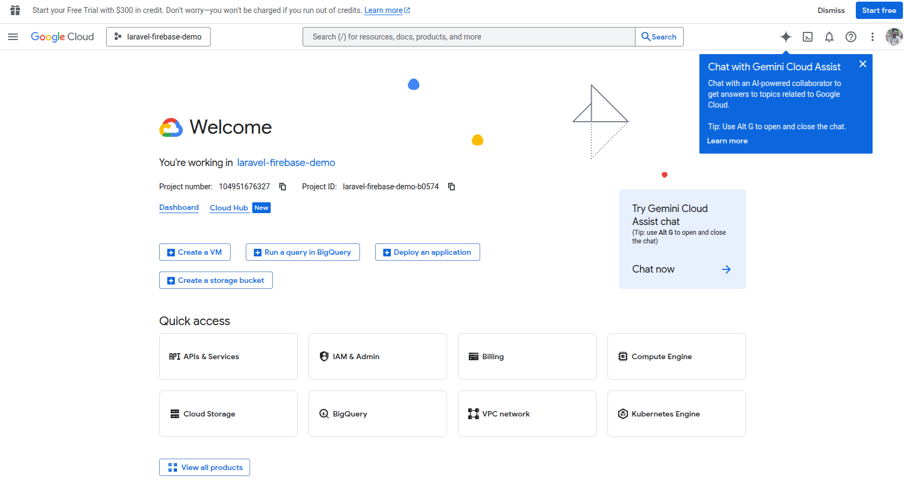
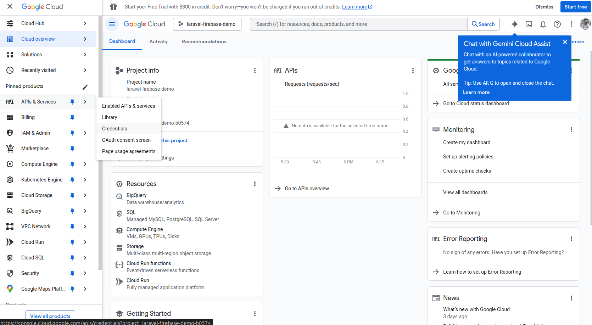
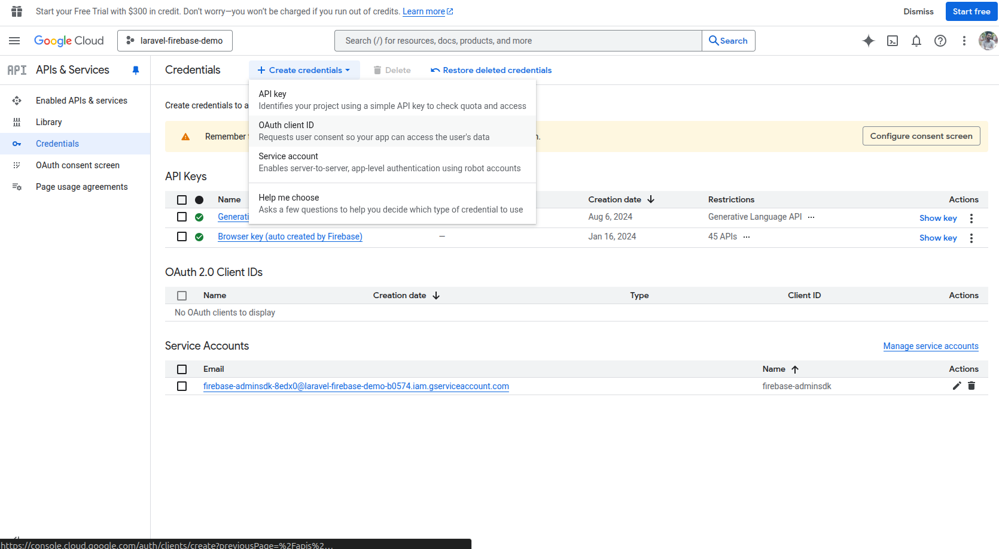
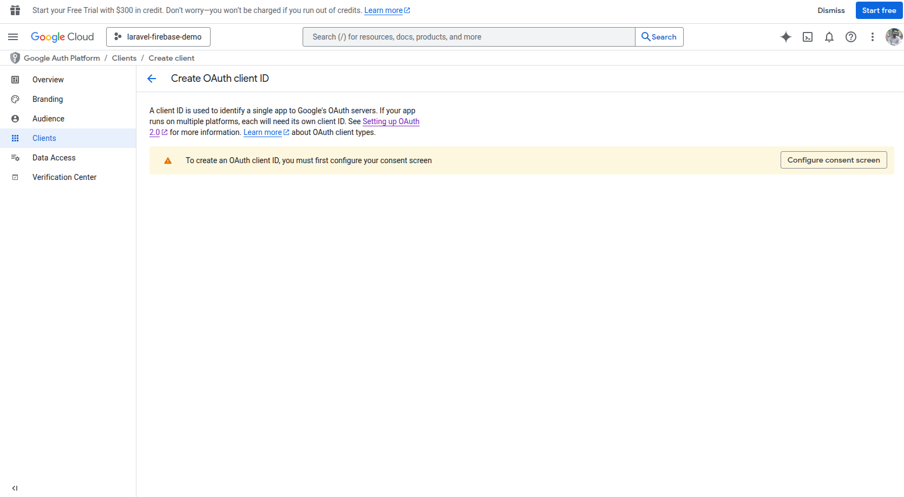
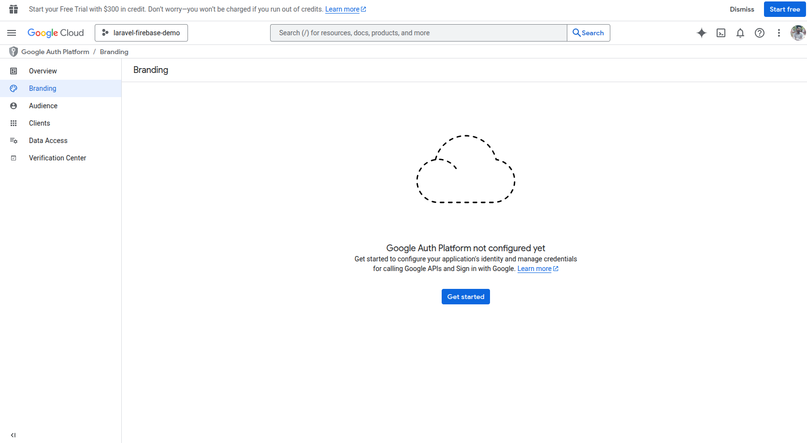
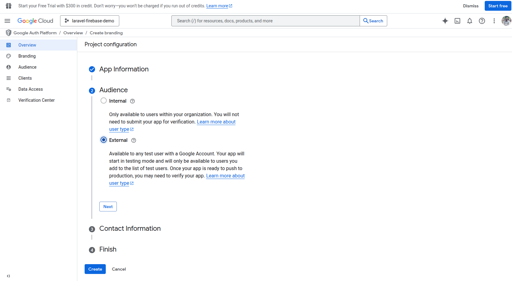
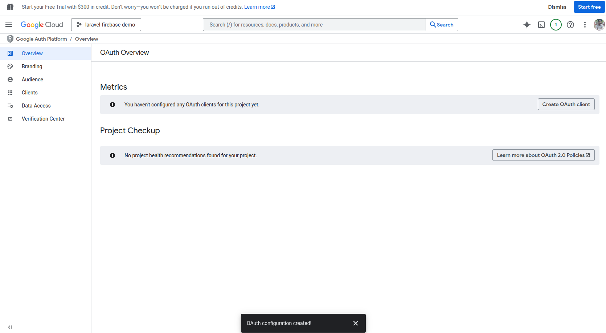
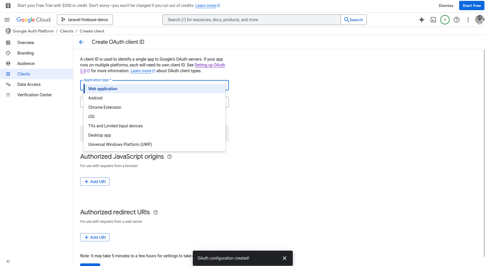
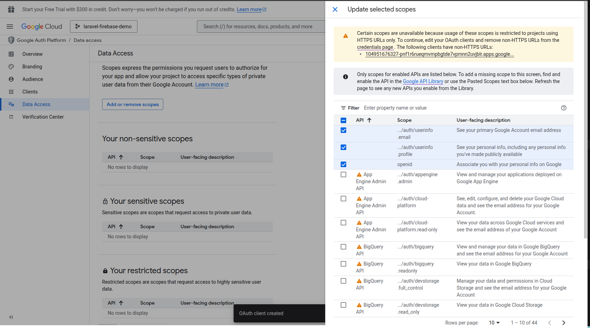

# Emmanuel Saleem Social Auth Package

A comprehensive Laravel package for OAuth social authentication with Google and Microsoft, supporting both traditional web applications and modern SPA/API-based frontends.

[](https://opensource.org/licenses/MIT)
[](https://laravel.com)
[](https://php.net)

## ✨ Features

- 🔐 **Google OAuth** authentication (Web & API)
- 🔐 **Microsoft OAuth** authentication (Web & API)
- 🌐 **Dual Mode Support**: Traditional web and SPA/API applications
- 🎨 **Pre-built Login UI** with beautiful, modern design
- 📱 **Mobile-friendly** responsive design
- 🔄 **Auto-migration** for adding social auth fields to users table
- 🛡️ **Secure** token management with Laravel Sanctum
- 📦 **Easy Installation** with Laravel auto-discovery
- ⚙️ **Configurable** routes, middleware, and redirects
- 🚀 **Production Ready** with comprehensive error handling

---

## 📋 Requirements

- PHP 8.1 or higher
- Laravel 10.x or 11.x
- Laravel Socialite 5.x
- Laravel Sanctum (for API authentication)

---

## 📦 Installation

### Step 1: Install via Composer

```bash
composer require emmanuel-saleem/social-auth
```

### Step 2: Install Laravel Sanctum (for API routes)

```bash
composer require laravel/sanctum
php artisan vendor:publish --provider="Laravel\Sanctum\SanctumServiceProvider"
php artisan migrate
```

### Step 3: Add HasApiTokens to User Model

```php
<?php

namespace App\Models;

use Illuminate\Foundation\Auth\User as Authenticatable;
use Laravel\Sanctum\HasApiTokens;

class User extends Authenticatable
{
    use HasApiTokens, HasFactory, Notifiable;
    
    protected $fillable = [
        'name',
        'email',
        'password',
        'google_id',
        'microsoft_id',
        'avatar',
        'google_token',
        'google_refresh_token',
        'microsoft_token',
        'microsoft_refresh_token',
        'email_verified_at',
    ];
}
```

### Step 4: Publish Package Assets

```bash
# Publish configuration file
php artisan vendor:publish --tag=emmanuel-saleem-social-auth-config

# Publish migrations
php artisan vendor:publish --tag=emmanuel-saleem-social-auth-migrations

# Publish views (optional - if you want to customize)
php artisan vendor:publish --tag=emmanuel-saleem-social-auth-views

# Run migrations
php artisan migrate
```

---

## ⚙️ Configuration

### Environment Variables

Add these to your `.env` file:

```env
# Google OAuth
GOOGLE_CLIENT_ID=your-google-client-id
GOOGLE_CLIENT_SECRET=your-google-client-secret
GOOGLE_REDIRECT_URI=http://localhost:8000/emmanuel-saleem/social-auth/google/callback

# Microsoft OAuth
MICROSOFT_CLIENT_ID=your-microsoft-client-id
MICROSOFT_CLIENT_SECRET=your-microsoft-client-secret
MICROSOFT_REDIRECT_URI=http://localhost:8000/emmanuel-saleem/social-auth/microsoft/callback

# Frontend URL (for API OAuth)
FRONTEND_URL=http://localhost:3000
```

### Update `config/services.php`

Add OAuth provider configurations:

```php
return [
    // ... other services

    'google' => [
        'client_id' => env('GOOGLE_CLIENT_ID'),
        'client_secret' => env('GOOGLE_CLIENT_SECRET'),
        'redirect' => env('GOOGLE_REDIRECT_URI'),
    ],

    'microsoft' => [
        'client_id' => env('MICROSOFT_CLIENT_ID'),
        'client_secret' => env('MICROSOFT_CLIENT_SECRET'),
        'redirect' => env('MICROSOFT_REDIRECT_URI'),
    ],
];
```

### OAuth Provider Setup

#### Google Cloud Console

Follow these steps to create OAuth credentials:

**Step 1:** Go to [Google Cloud Console](https://console.cloud.google.com/)

**Step 2:** Create a new project or select an existing one



**Step 3:** Navigate to "APIs & Services" → "Credentials"



**Step 4:** Click "CREATE CREDENTIALS" → Select "OAuth client ID"



**Step 5:** Configure the OAuth consent screen (if first time)



**Step 6:** Select "Web application" as the application type



**Step 7:** Add your application name and authorized redirect URIs:



**Authorized redirect URIs:**
- For Web: `http://localhost:8000/emmanuel-saleem/social-auth/google/callback`
- For API/SPA: `http://localhost:3000/auth/google/callback`
- For Production: `https://yourdomain.com/emmanuel-saleem/social-auth/google/callback`

**Step 8:** Click "CREATE" and you'll receive your credentials



**Step 9:** Copy the **Client ID** and **Client Secret** to your `.env` file



**Step 10:** Enable required APIs (Google+ API or People API)



✅ **Configuration Complete!** Now add the credentials to your `.env` file:

```env
GOOGLE_CLIENT_ID=your-client-id-from-step-9
GOOGLE_CLIENT_SECRET=your-client-secret-from-step-9
GOOGLE_REDIRECT_URI=http://localhost:8000/emmanuel-saleem/social-auth/google/callback
```

#### Microsoft Azure Portal

1. Go to [Azure Portal](https://portal.azure.com/)
2. Navigate to Azure Active Directory → App registrations
3. Click "New registration"
4. **Redirect URI:** 
   - Web: `http://localhost:8000/emmanuel-saleem/social-auth/microsoft/callback`
   - API: `http://localhost:3000/auth/microsoft/callback`
5. Create client secret under Certificates & secrets
6. **API permissions:** Microsoft Graph → Add permissions:
   - openid
   - profile
   - email
   - User.Read
7. Grant admin consent

---

## 🚀 Usage

### Option 1: Traditional Web Application

#### Routes Available

The package automatically registers these web routes:

```php
// Login page
GET /emmanuel-saleem/social-auth/login

// Google OAuth
GET /emmanuel-saleem/social-auth/google
GET /emmanuel-saleem/social-auth/google/callback

// Microsoft OAuth (future)
GET /emmanuel-saleem/social-auth/microsoft
GET /emmanuel-saleem/social-auth/microsoft/callback

// Logout
POST /emmanuel-saleem/social-auth/logout
```

#### Implementation

**Option A: Use the built-in login page**

Simply redirect users to the login page:

```html
<!-- In your blade template -->
<a href="{{ route('emmanuel-saleem.social-auth.login') }}" class="btn btn-primary">
    Login with Social
</a>
```

**Option B: Include the component in your own page**

The package provides a reusable Blade component that you can include anywhere:

```blade
<!DOCTYPE html>
<html>
<head>
    <title>Login</title>
</head>
<body>
    <div class="container">
        <h1>Welcome to Our App</h1>
        <p>Please sign in to continue</p>
        
        {{-- Include social auth buttons --}}
        @include('emmanuel-saleem-social-auth::login')
    </div>
</body>
</html>
```

**Option C: Use individual buttons**

```html
<!-- Google button -->
<a href="{{ route('emmanuel-saleem.social-auth.google') }}" class="btn btn-google">
    Sign in with Google
</a>

<!-- Microsoft button -->
<a href="{{ route('emmanuel-saleem.social-auth.microsoft') }}" class="btn btn-microsoft">
    Sign in with Microsoft
</a>
```

#### Logout

```html
<form action="{{ route('emmanuel-saleem.social-auth.logout') }}" method="POST">
    @csrf
    <button type="submit">Logout</button>
</form>
```

---

### Option 2: API / SPA Application

For React, Vue, Next.js, or other frontend applications, use the API endpoints.

#### API Routes Available

```php
// Google OAuth
GET  /api/emmanuel-saleem/auth/google/url
POST /api/emmanuel-saleem/auth/google/callback

// Microsoft OAuth
GET  /api/emmanuel-saleem/auth/microsoft/url
POST /api/emmanuel-saleem/auth/microsoft/callback
```

#### Quick Start Example (React)

```jsx
import React from 'react';

const LoginPage = () => {
  const handleGoogleLogin = async () => {
    // Step 1: Get Google auth URL
    const response = await fetch('/api/emmanuel-saleem/auth/google/url');
    const result = await response.json();
    
    // Step 2: Redirect user to Google
    if (result.status) {
      window.location.href = result.data.url;
    }
  };

  return (
    <button onClick={handleGoogleLogin}>
      Sign in with Google
    </button>
  );
};
```

```jsx
// OAuth Callback Component
import { useEffect } from 'react';
import { useNavigate, useLocation } from 'react-router-dom';

const GoogleCallback = () => {
  const navigate = useNavigate();
  const location = useLocation();

  useEffect(() => {
    const handleCallback = async () => {
      const params = new URLSearchParams(location.search);
      const code = params.get('code');

      const response = await fetch('/api/emmanuel-saleem/auth/google/callback', {
        method: 'POST',
        headers: { 'Content-Type': 'application/json' },
        body: JSON.stringify({ code }),
      });

      const result = await response.json();

      if (result.status) {
        // Store token
        localStorage.setItem('token', result.data.token);
        navigate('/dashboard');
      }
    };

    handleCallback();
  }, []);

  return <div>Logging in...</div>;
};
```

**📖 For complete API integration guide, see [OAUTH_API_GUIDE.md](./OAUTH_API_GUIDE.md)**

---

## 📡 API Response Format

All API endpoints return standardized JSON responses:

### Success Response

```json
{
  "status": true,
  "success": "success",
  "code": 200,
  "message": "Successfully authenticated with Google",
  "errors": [],
  "data": {
    "token": "1|eyJ0eXAiOiJKV1QiLCJhbGc...",
    "user": {
      "id": 1,
      "name": "John Doe",
      "email": "john@example.com",
      "avatar": "https://...",
      "oauth_provider": "google",
      "created_at": "2024-01-01T00:00:00.000000Z"
    }
  }
}
```

### Error Response

```json
{
  "status": false,
  "success": "error",
  "code": 401,
  "message": "Failed to authenticate with Google",
  "errors": {
    "exception": "Invalid authorization code"
  },
  "data": null
}
```

---

## 🎨 Customization

### Customize Button Labels

You can customize the button text via `.env` file:

```env
# Button Labels
SOCIAL_AUTH_GOOGLE_LABEL="Sign in with Google"
SOCIAL_AUTH_MICROSOFT_LABEL="Sign in with Microsoft"
```

Or in the config file `config/emmanuel-saleem-social-auth.php`:

```php
'labels' => [
    'google_button' => 'Login with Google Account',
    'microsoft_button' => 'Login with Microsoft Account',
],
```

### Customize Footer

Hide the footer:

```env
SOCIAL_AUTH_SHOW_FOOTER=false
```

Or customize the footer text:

```env
SOCIAL_AUTH_FOOTER_TEXT="Secure Login Powered by OAuth"
```

In config file:

```php
'show_footer' => false, // Hide footer
'footer_text' => 'Your custom footer text',
```

### Customize Routes Prefix

Edit `config/emmanuel-saleem-social-auth.php`:

```php
'route_prefix' => 'auth', // Changes routes to /auth/...
```

### Customize Redirects

```php
'redirect_after_login' => '/dashboard',
'redirect_after_logout' => '/welcome',
```

### Customize Middleware

```php
'middleware' => [
    'web' => ['web', 'guest'],
    'api' => ['api'],
],
```

### Customize Views

After publishing views:

```bash
php artisan vendor:publish --tag=emmanuel-saleem-social-auth-views
```

Edit the views in `resources/views/vendor/emmanuel-saleem-social-auth/`

The component includes:
- ✅ Both Google and Microsoft buttons with official icons
- ✅ Responsive design (mobile-friendly)
- ✅ Error/success message display
- ✅ Modern, clean UI
- ✅ Inline CSS (no external dependencies)
- ✅ Customizable labels and footer
- ✅ Can be included in any existing page

---

## 🗄️ Database Schema

The package adds these fields to your `users` table:

| Column | Type | Description |
|--------|------|-------------|
| `google_id` | string | Google user ID |
| `microsoft_id` | string | Microsoft user ID |
| `avatar` | string | Profile picture URL |
| `google_token` | text | Google access token |
| `google_refresh_token` | text | Google refresh token |
| `microsoft_token` | text | Microsoft access token |
| `microsoft_refresh_token` | text | Microsoft refresh token |

The `password` column is also made nullable to support social-only users.

---

## 🔒 Security

- All OAuth tokens are stored securely in the database
- Passwords for OAuth users are randomly generated and hashed
- Email verification is automatically marked as verified for OAuth users
- CSRF protection on all web routes
- Stateless OAuth for API routes

---

## 🧪 Testing

### Test Web Routes

```bash
# Visit in browser
http://localhost:8000/emmanuel-saleem/social-auth/login
```

### Test API Routes

```bash
# Get Google auth URL
curl http://localhost:8000/api/emmanuel-saleem/auth/google/url

# Test callback (after getting code from Google)
curl -X POST http://localhost:8000/api/emmanuel-saleem/auth/google/callback \
  -H "Content-Type: application/json" \
  -d '{"code":"YOUR_AUTHORIZATION_CODE"}'
```

---

## 🐛 Troubleshooting

### Issue: "Class not found" error

**Solution:** Make sure to run `composer dump-autoload`

### Issue: Routes not working

**Solution:** Clear route cache:
```bash
php artisan route:clear
php artisan config:clear
php artisan cache:clear
```

### Issue: "redirect_uri_mismatch"

**Solution:** Ensure your redirect URIs in `.env` match exactly with those in Google/Microsoft console

### Issue: Token creation fails

**Solution:** Make sure:
1. Laravel Sanctum is installed
2. User model has `HasApiTokens` trait
3. Migrations have run

### Issue: CORS errors in API

**Solution:** Configure CORS in `config/cors.php`:
```php
'paths' => ['api/*'],
'allowed_origins' => [env('FRONTEND_URL', 'http://localhost:3000')],
```

---

## 📚 Documentation

- [API Integration Guide](./OAUTH_API_GUIDE.md) - Complete guide for SPA/API integration
- [Laravel Socialite Docs](https://laravel.com/docs/socialite)
- [Laravel Sanctum Docs](https://laravel.com/docs/sanctum)

---

## 🛣️ Roadmap

- [x] Google OAuth support
- [x] Microsoft OAuth support
- [x] API endpoints for SPA
- [x] Standardized response format
- [ ] GitHub OAuth support
- [ ] Facebook OAuth support
- [ ] LinkedIn OAuth support
- [ ] Twitter/X OAuth support
- [ ] Two-factor authentication
- [ ] Social account linking
- [ ] Admin panel for managing OAuth apps

---

## 🤝 Contributing

Contributions are welcome! Please feel free to submit a Pull Request.

1. Fork the repository
2. Create your feature branch (`git checkout -b feature/AmazingFeature`)
3. Commit your changes (`git commit -m 'Add some AmazingFeature'`)
4. Push to the branch (`git push origin feature/AmazingFeature`)
5. Open a Pull Request

---

## 📄 License

This package is open-sourced software licensed under the [MIT license](LICENSE).

---

## 👨‍💻 Author

**Emmanuel Saleem**

- Email: your@email.com
- GitHub: [@emmanuel-saleem](https://github.com/emmanuel-saleem)

---

## 🙏 Acknowledgments

- Laravel Socialite team
- Laravel Sanctum team
- All contributors

---

## 📞 Support

If you encounter any issues or have questions:

1. Check the [OAUTH_API_GUIDE.md](./OAUTH_API_GUIDE.md)
2. Review [Troubleshooting](#-troubleshooting) section
3. Check existing [GitHub Issues](https://github.com/emmanuel-saleem/social-auth/issues)
4. Create a new issue with detailed information

---

**Made with ❤️ for the Laravel community**

